# Snowflake RBAC Diagram

Visual reference for the RBAC model built in this module.

```mermaid
graph TD

  %% ── System Roles ──────────────────────────────────────────────
  ACCOUNTADMIN([ACCOUNTADMIN])
  SYSADMIN([SYSADMIN])
  SECURITYADMIN([SECURITYADMIN])

  ACCOUNTADMIN --> SYSADMIN
  ACCOUNTADMIN --> SECURITYADMIN

  %% ── Ownership Roles ───────────────────────────────────────────
  subgraph OWNERSHIP["Ownership Roles"]
    OWN_RAW_DEV(ROLE_OWNER_RAW_DEV)
    OWN_RAW_PROD(ROLE_OWNER_RAW_PROD)
    OWN_TRANS_DEV(ROLE_OWNER_TRANSFORMED_DEV)
    OWN_TRANS_PROD(ROLE_OWNER_TRANSFORMED_PROD)
  end

  SYSADMIN --> OWN_RAW_DEV
  SYSADMIN --> OWN_RAW_PROD
  SYSADMIN --> OWN_TRANS_DEV
  SYSADMIN --> OWN_TRANS_PROD

  %% ── Warehouses ────────────────────────────────────────────────
  subgraph WH_DEV["Warehouses — DEV"]
    WH_DE_DEV[(WH_DATA_ENGINEER_DEV\nXSMALL)]
    WH_INGEST_DEV[(WH_DATA_INGEST_DEV\nXSMALL)]
    WH_DBTU_DEV[(WH_DBT_USER_DEV\nXSMALL)]
    WH_SVC_DEV[(WH_DBT_SVC_DEV\nSMALL)]
  end

  subgraph WH_PROD["Warehouses — PROD"]
    WH_DE_PROD[(WH_DATA_ENGINEER_PROD\nXSMALL)]
    WH_INGEST_PROD[(WH_DATA_INGEST_PROD\nXSMALL)]
    WH_DBTU_PROD[(WH_DBT_USER_PROD\nXSMALL)]
    WH_SVC_PROD[(WH_DBT_SVC_PROD\nSMALL)]
  end

  %% ── Functional Roles ──────────────────────────────────────────
  subgraph FUNC_DEV["Functional Roles — DEV"]
    DE_DEV>ROLE_DATA_ENGINEER_DEV]
    INGEST_DEV>ROLE_DATA_INGEST_DEV]
    DBTU_DEV>ROLE_DBT_USER_DEV]
    SVC_DEV>ROLE_DBT_SERVICE_ACCOUNT_DEV]
  end

  subgraph FUNC_PROD["Functional Roles — PROD"]
    DE_PROD>ROLE_DATA_ENGINEER_PROD]
    INGEST_PROD>ROLE_DATA_INGEST_PROD]
    DBTU_PROD>ROLE_DBT_USER_PROD]
    SVC_PROD>ROLE_DBT_SERVICE_ACCOUNT_PROD]
  end

  ALL_READ>ROLE_DATA_ENGINEER_ALL_READ]

  SYSADMIN --> DE_DEV
  SYSADMIN --> INGEST_DEV
  SYSADMIN --> DBTU_DEV
  SYSADMIN --> SVC_DEV
  SYSADMIN --> DE_PROD
  SYSADMIN --> INGEST_PROD
  SYSADMIN --> DBTU_PROD
  SYSADMIN --> SVC_PROD
  SYSADMIN --> ALL_READ

  %% warehouse usage (dashed)
  DE_DEV    -. USAGE/OPERATE .-> WH_DE_DEV
  INGEST_DEV -. USAGE/OPERATE .-> WH_INGEST_DEV
  DBTU_DEV  -. USAGE/OPERATE .-> WH_DBTU_DEV
  SVC_DEV   -. USAGE/OPERATE .-> WH_SVC_DEV
  DE_PROD   -. USAGE/OPERATE .-> WH_DE_PROD
  INGEST_PROD -. USAGE/OPERATE .-> WH_INGEST_PROD
  DBTU_PROD -. USAGE/OPERATE .-> WH_DBTU_PROD
  SVC_PROD  -. USAGE/OPERATE .-> WH_SVC_PROD

  %% ── Schema Creator Roles ──────────────────────────────────────
  subgraph SCHEMA_CREATE["Schema Creator Roles"]
    SC_RAW_DEV(ROLE_SCHEMA_CREATE_RAW_DEV)
    SC_RAW_PROD(ROLE_SCHEMA_CREATE_RAW_PROD)
    SC_TRANS_DEV(ROLE_SCHEMA_CREATE_TRANSFORMED_DEV)
    SC_TRANS_PROD(ROLE_SCHEMA_CREATE_TRANSFORMED_PROD)
  end

  SYSADMIN --> SC_RAW_DEV
  SYSADMIN --> SC_RAW_PROD
  SYSADMIN --> SC_TRANS_DEV
  SYSADMIN --> SC_TRANS_PROD

  %% ── Access Roles ──────────────────────────────────────────────
  subgraph ACC_RAW_DEV["Access Roles — RAW_DEV"]
    RAW_DEV_R(ROLE_RAW_DEV_READ)
    RAW_DEV_W(ROLE_RAW_DEV_WRITE)
    RAW_DEV_C(ROLE_RAW_DEV_CREATE)
  end

  subgraph ACC_TRANS_DEV["Access Roles — TRANSFORMED_DEV"]
    TRANS_DEV_R(ROLE_TRANSFORMED_DEV_READ)
    TRANS_DEV_W(ROLE_TRANSFORMED_DEV_WRITE)
    TRANS_DEV_C(ROLE_TRANSFORMED_DEV_CREATE)
  end

  subgraph ACC_RAW_PROD["Access Roles — RAW_PROD"]
    RAW_PROD_R(ROLE_RAW_PROD_READ)
    RAW_PROD_W(ROLE_RAW_PROD_WRITE)
    RAW_PROD_C(ROLE_RAW_PROD_CREATE)
  end

  subgraph ACC_TRANS_PROD["Access Roles — TRANSFORMED_PROD"]
    TRANS_PROD_R(ROLE_TRANSFORMED_PROD_READ)
    TRANS_PROD_W(ROLE_TRANSFORMED_PROD_WRITE)
    TRANS_PROD_C(ROLE_TRANSFORMED_PROD_CREATE)
  end

  SYSADMIN --> RAW_DEV_R
  SYSADMIN --> RAW_DEV_W
  SYSADMIN --> RAW_DEV_C
  SYSADMIN --> TRANS_DEV_R
  SYSADMIN --> TRANS_DEV_W
  SYSADMIN --> TRANS_DEV_C
  SYSADMIN --> RAW_PROD_R
  SYSADMIN --> RAW_PROD_W
  SYSADMIN --> RAW_PROD_C
  SYSADMIN --> TRANS_PROD_R
  SYSADMIN --> TRANS_PROD_W
  SYSADMIN --> TRANS_PROD_C

  %% DATA_ENGINEER_DEV → read+write on both DEV DBs (no CREATE)
  DE_DEV --> RAW_DEV_R
  DE_DEV --> RAW_DEV_W
  DE_DEV --> TRANS_DEV_R
  DE_DEV --> TRANS_DEV_W

  %% DATA_ENGINEER_PROD → read-only on both PROD DBs
  DE_PROD --> RAW_PROD_R
  DE_PROD --> TRANS_PROD_R

  %% DATA_INGEST_DEV → full raw DEV access + schema create
  INGEST_DEV --> RAW_DEV_R
  INGEST_DEV --> RAW_DEV_W
  INGEST_DEV --> RAW_DEV_C
  INGEST_DEV --> SC_RAW_DEV

  %% DATA_INGEST_PROD → full raw PROD access + schema create
  INGEST_PROD --> RAW_PROD_R
  INGEST_PROD --> RAW_PROD_W
  INGEST_PROD --> RAW_PROD_C
  INGEST_PROD --> SC_RAW_PROD

  %% DBT_USER_DEV → read raw, full transformed DEV + schema create
  DBTU_DEV --> RAW_DEV_R
  DBTU_DEV --> TRANS_DEV_R
  DBTU_DEV --> TRANS_DEV_W
  DBTU_DEV --> TRANS_DEV_C
  DBTU_DEV --> SC_TRANS_DEV

  %% DBT_USER_PROD → read raw, full transformed PROD (target state)
  DBTU_PROD --> RAW_PROD_R
  DBTU_PROD --> TRANS_PROD_R
  DBTU_PROD --> TRANS_PROD_W
  DBTU_PROD --> TRANS_PROD_C

  %% ALL_READ aggregation role
  ALL_READ --> RAW_DEV_R
  ALL_READ --> TRANS_DEV_R
  ALL_READ --> RAW_PROD_R
  ALL_READ --> TRANS_PROD_R

  %% ── Databases ─────────────────────────────────────────────────
  subgraph DB_RAW_DEV["RAW_DEV"]
    SCHEMA_SRC1_DEV[SOURCE1]
    SCHEMA_SRC2_DEV[SOURCE2]
  end

  subgraph DB_RAW_PROD["RAW_PROD"]
    SCHEMA_SRC1_PROD[SOURCE1]
    SCHEMA_SRC2_PROD[SOURCE2]
  end

  DB_TRANS_DEV[(TRANSFORMED_DEV\ndbt-managed schemas)]
  DB_TRANS_PROD[(TRANSFORMED_PROD\ndbt-managed schemas)]

  OWN_RAW_DEV  -. owns .-> DB_RAW_DEV
  OWN_RAW_PROD -. owns .-> DB_RAW_PROD
  OWN_TRANS_DEV  -. owns .-> DB_TRANS_DEV
  OWN_TRANS_PROD -. owns .-> DB_TRANS_PROD

  SC_RAW_DEV   -. CREATE SCHEMA .-> DB_RAW_DEV
  SC_RAW_PROD  -. CREATE SCHEMA .-> DB_RAW_PROD
  SC_TRANS_DEV -. CREATE SCHEMA .-> DB_TRANS_DEV
  SC_TRANS_PROD -. CREATE SCHEMA .-> DB_TRANS_PROD

  RAW_DEV_R -. SELECT .-> DB_RAW_DEV
  RAW_DEV_W -. INSERT/UPDATE/DELETE .-> DB_RAW_DEV
  RAW_DEV_C -. CREATE objects .-> DB_RAW_DEV

  RAW_PROD_R -. SELECT .-> DB_RAW_PROD
  RAW_PROD_W -. INSERT/UPDATE/DELETE .-> DB_RAW_PROD
  RAW_PROD_C -. CREATE objects .-> DB_RAW_PROD

  TRANS_DEV_R -. SELECT .-> DB_TRANS_DEV
  TRANS_DEV_W -. INSERT/UPDATE/DELETE .-> DB_TRANS_DEV
  TRANS_DEV_C -. CREATE objects .-> DB_TRANS_DEV

  TRANS_PROD_R -. SELECT .-> DB_TRANS_PROD
  TRANS_PROD_W -. INSERT/UPDATE/DELETE .-> DB_TRANS_PROD
  TRANS_PROD_C -. CREATE objects .-> DB_TRANS_PROD

  %% ── Styling ───────────────────────────────────────────────────
  classDef sysrole      fill:#1a1a2e,color:#eee,stroke:#444
  classDef ownership    fill:#16213e,color:#eee,stroke:#444
  classDef functional   fill:#0f3460,color:#eee,stroke:#57b0f6
  classDef svc_stub     fill:#1a1a1a,color:#888,stroke:#555,stroke-dasharray:4
  classDef schema_create fill:#004d4d,color:#eee,stroke:#00bfbf
  classDef access_read  fill:#065a2e,color:#eee,stroke:#27ae60
  classDef access_write fill:#7a3600,color:#eee,stroke:#e67e22
  classDef access_create fill:#4a0072,color:#eee,stroke:#9b59b6
  classDef warehouse    fill:#2d2d2d,color:#ccc,stroke:#888
  classDef database     fill:#1a3a4a,color:#eee,stroke:#3498db

  class ACCOUNTADMIN,SYSADMIN,SECURITYADMIN sysrole
  class OWN_RAW_DEV,OWN_RAW_PROD,OWN_TRANS_DEV,OWN_TRANS_PROD ownership
  class DE_DEV,INGEST_DEV,DBTU_DEV,DE_PROD,INGEST_PROD,DBTU_PROD,ALL_READ functional
  class SVC_DEV,SVC_PROD svc_stub
  class SC_RAW_DEV,SC_RAW_PROD,SC_TRANS_DEV,SC_TRANS_PROD schema_create
  class RAW_DEV_R,TRANS_DEV_R,RAW_PROD_R,TRANS_PROD_R access_read
  class RAW_DEV_W,TRANS_DEV_W,RAW_PROD_W,TRANS_PROD_W access_write
  class RAW_DEV_C,TRANS_DEV_C,RAW_PROD_C,TRANS_PROD_C access_create
  class WH_DE_DEV,WH_INGEST_DEV,WH_DBTU_DEV,WH_SVC_DEV,WH_DE_PROD,WH_INGEST_PROD,WH_DBTU_PROD,WH_SVC_PROD warehouse
  class DB_RAW_DEV,DB_RAW_PROD,DB_TRANS_DEV,DB_TRANS_PROD,SCHEMA_SRC1_DEV,SCHEMA_SRC2_DEV,SCHEMA_SRC1_PROD,SCHEMA_SRC2_PROD database
```

## Legend

| Color | Layer |
|-------|-------|
| Dark navy | System roles (ACCOUNTADMIN, SYSADMIN, SECURITYADMIN) |
| Navy | Ownership roles — single-owner strategy per database |
| Blue | Functional roles — assigned to human users or service accounts |
| Dim/dashed | `ROLE_DBT_SERVICE_ACCOUNT_*` — defined in `2.2`, warehouse only, no DB access grants |
| Teal | Schema creator roles — `CREATE SCHEMA` privilege only |
| Green | Access roles — READ (SELECT) |
| Orange | Access roles — WRITE (INSERT / UPDATE / DELETE) |
| Purple | Access roles — CREATE (tables, views, stages, functions…) |
| Grey | Warehouses |
| Dark teal | Databases and schemas |

Solid arrows (`-->`) = role inheritance. Dashed arrows (`-.->`) = privilege grants.

> **Note:** `ROLE_DBT_USER_PROD` → `TRANSFORMED_PROD` grants and the full `TRANSFORMED_DEV` access grants are part of the **challenge in `2.6`**. The diagram shows the complete target state.
